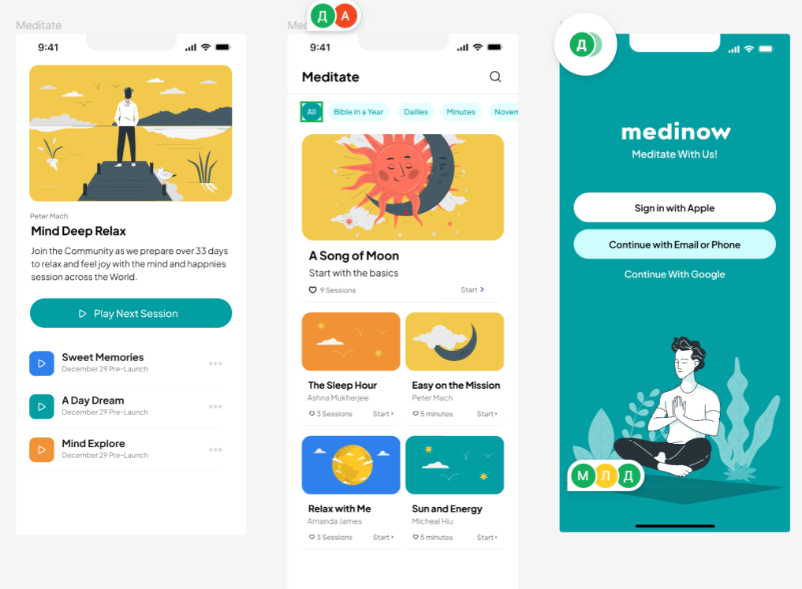
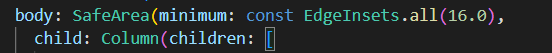
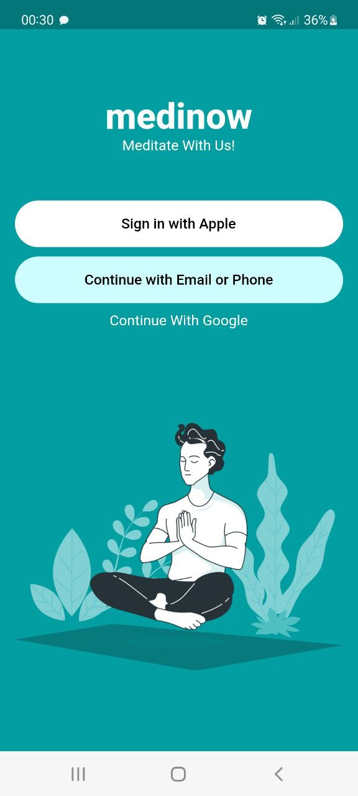
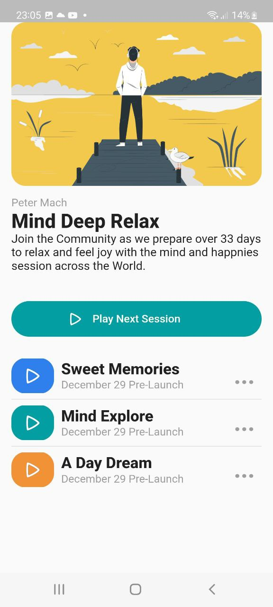
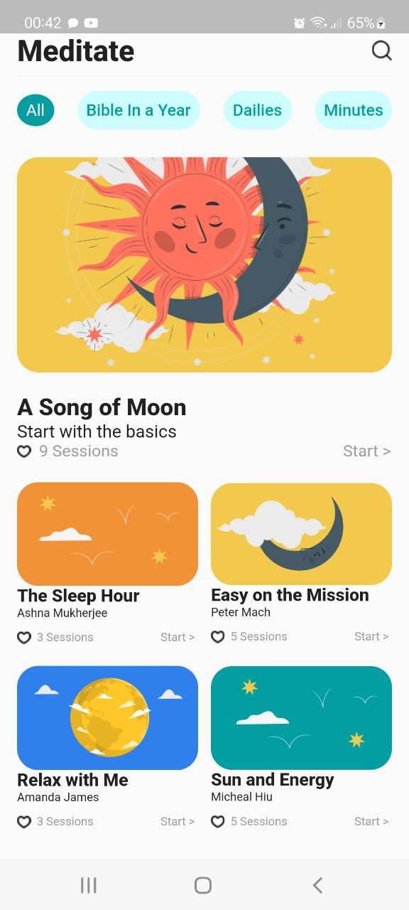

<h1 align="center">Практическая работа №1</h1>

## Тема: Работа с основными виджетами flutter

<p style="text-indent: 25px;">Цель работы: научиться работать с основными виджетами и сделать 3 макета из пяти предложенных.

<h2 align="center">Ход работы</h2>
<p style="text-indent: 25px;">Для выполнения практической работы были выбраны 3 следующих макета:

<p align="center">
  
</p>

Для верстки каждого макета вышестоящими виджетами выступали: ```SafeArea``` и ```Column```.

<p align="center">
  
</p>

```SafeArea``` выделяет отступы для специфичности смартфона, а ```Column``` отображает дочерние виджеты в столбец.

<h3 align="center">Medinow.dart</h3>

<p align="center">
  
</p>

Фон первого макета был сделан при помощи ключа ```backgroundColor``` виджета ```Scaffold```. Толщина шрифта в слове «medinow» была достигнута при помощи ключа style. ( ``` style: TextStyle(color: Colors.white, fontFamily: '', fontSize: 35, fontWeight: FontWeight.w800```). Кнопки были помещены в контейнер и растянуты при помощи ```width: double.infinity```. Закругление кнопок удалось добиться при помощи:
 ```shape: MaterialStateProperty.all<RoundedRectangleBorder>((borderRadius: BorderRadius.circular(50)))``` прописанного в стиле кнопки. Отступы между виджетами прописывались в контейнерах при помощи padding. Для добавления картинки в макет, необходимо было сначала добавить картинку в папку проекта, а далее в файле pubspec.yaml в параметре assets прописать путь до фотографии. За картинки отвечает виджет Image с параметром asset.

<h3 align="center">MindDeepRelax.dart</h3>

 <p align="center">
  
</p>

Для закругления картинки во втором макете использовался виджет ```ClipRRect``` с ключом ```borderRadius: BorderRadius.circular(20.0)```. Кнопка с надписью «Play Next Session» была помещена с картинкой треугольника в виджет ```Stack```, чтобы треугольник находился на кнопке с текстом. Для следующих треков использовался ```Row``` хранящий в себе картинку, ```Column``` с двумя текстами, выровненными по левому краю при помощи ```crossAxisAlignment: CrossAxisAlignment.start```, и троеточие находящиеся в контейнере выравненным по правой стороне. За линию после каждого трека отвечает ```Divider```.

<h3 align="center">Meditate.dart</h3>

 <p align="center">
  
</p>

 Для того чтобы отобразить надпись «Meditate» и лупу по углам использовался ```Row``` с ключом
 ```mainAxisAlignment: MainAxisAlignment.spaceBetween```, позволяющий распределить дочерние виджеты равномерно по всему ```Row```. Таким же образом были расставлены закругленные кнопки. Нижняя часть каждой сессии была сделана при помощи ```Row``` и использованием ключа ```mainAxisAlignment```, только на этот раз в данном виджете хранился еще один ```Row``` с сердечком и номером сессии, а после нижестоящего ```Row``` уже находится просто надпись «Start >».

<p style="text-indent: 25px;">Вывод: удалось ознакомиться с основными виджетами flutter и воссоздать 3 макета.
