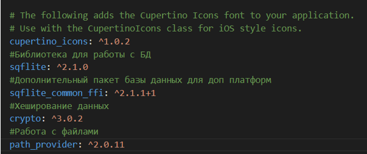
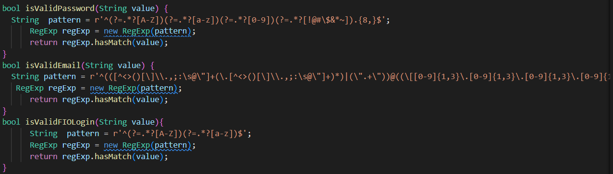
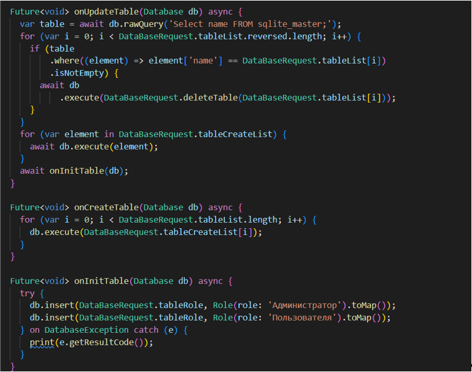
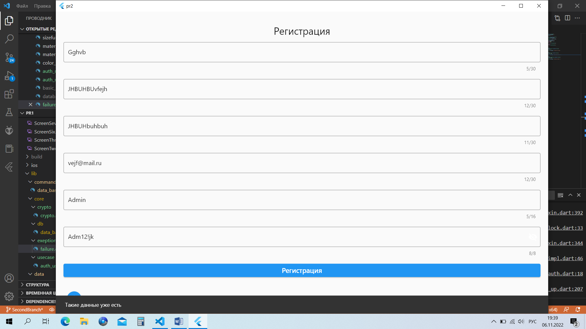
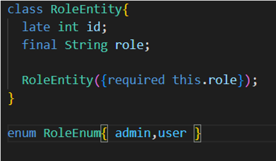
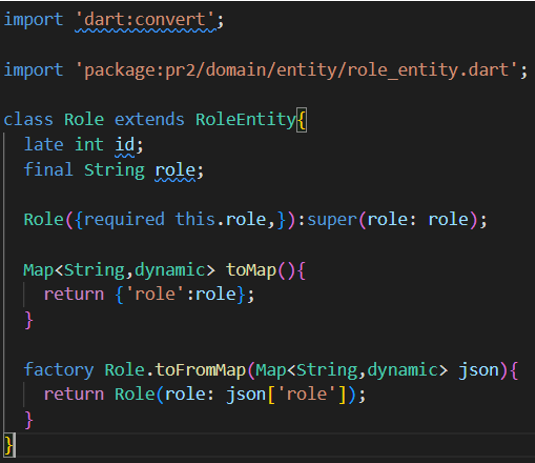
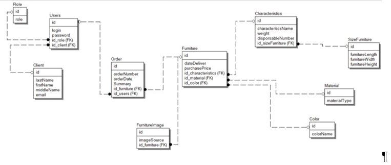

<h1 align="center">ПРАКТИЧЕСКАЯ РАБОТА №2</h1>

## Работа с sqllite

Цель работы: реализовать заготовку для будущего приложения магазина мебели. 
Ход работы: 
Для работы с файлами и БД необходимо в файле pubspec подключить следующие библиотеки:
 

  

В рамках практической работы необходимо реализовать два класса которые отвечает за базу данных. В классе DataBaseRequest содержатся sql запросы (создания таблиц, удаления и т.п.).
 

  

Класс DataBaseHelper хранит в себе самые основные функции для работы с БД, такие как: инициализация базы данных для всех платформ, создание таблиц, обновление таблиц, заполнение таблиц данными, удаление базы данных. 
 

  

Инициализация и удаление БД на смартфонах отличается от других ОС.
 

  

Также в рамках практической работы необходимы реализовать таблицы для предметной области "Магазин мебели". Для реализации таблиц будет строиться сущностях и моделях.
Entity файл:
 

  

Модель:
 

  

Остальные таблицы реализованы по такому же принципу.

 

  

Вывод: удалось сделать заготовку, в которую входят: реализация класса, отвечающего за базу данных, реализация функций для взаимодействия с БД, реализация таблиц предметной области для будущего приложения магазина мебели. 

