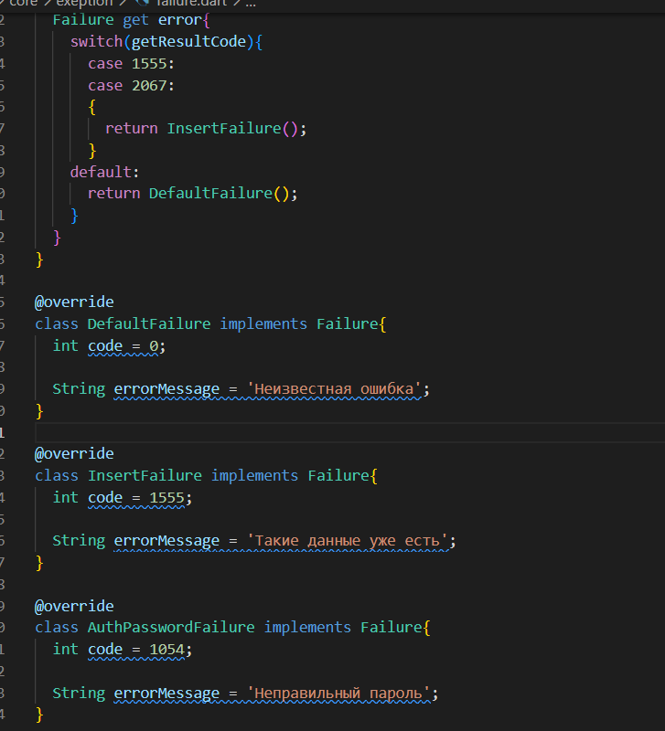
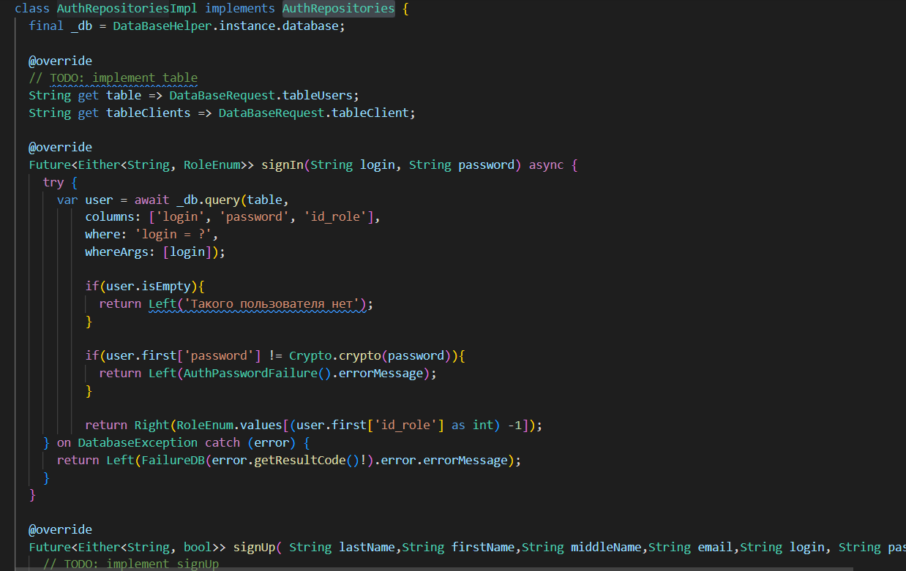
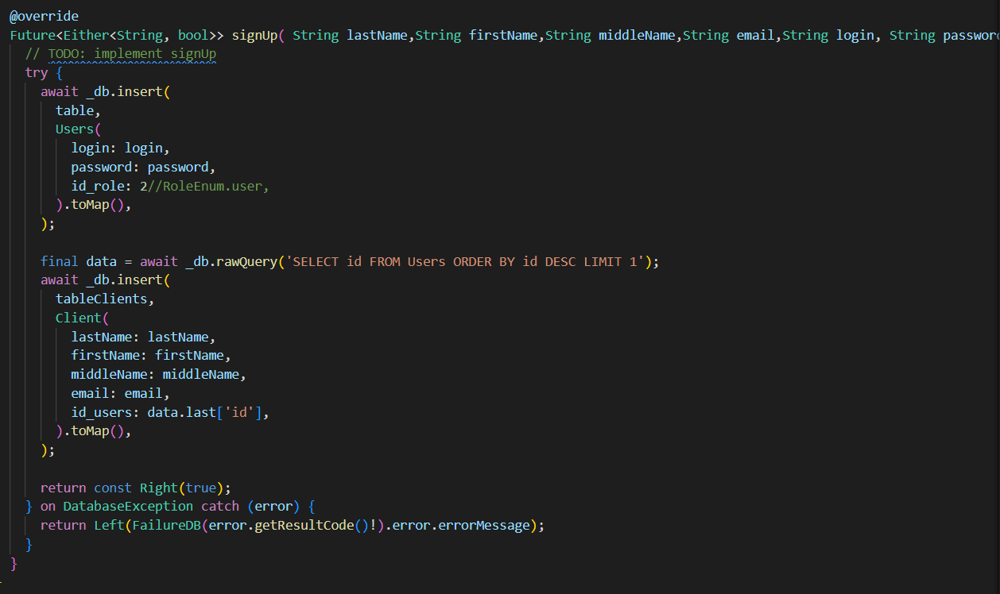
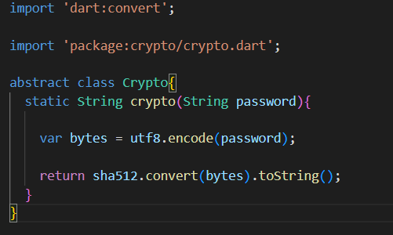
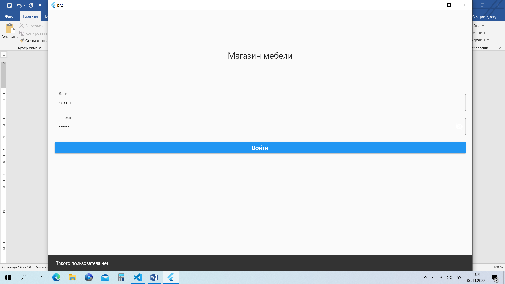

<h1 align="center">ПРАКТИЧЕСКАЯ РАБОТА №3</h1>

## Реализация регистрации и авторизации пользователя.

Цель работы: реализовать регистрацию и авторизацию пользователя, где поле на экране авторизации и регистрации провалидировать минимум 3 критериями максимум 5. После успешной авторизации перейти на экран в зависимости от роли пользователя. Если авторизация или регистрация не удалась нужно вывести сообщение при помощи Snack Bar.

Ход работы:
 
Для начала необходимо отверстать страницу регистрации с провалидированными полями.
 

  

Проверки писались при помощи валидатора текстового поля, а также при помощи собственно созданных функций.

  

Валидации полей недостаточно, т.к. могут произойти различные ошибки на уровне БД. (пример: пользователь захотел зарегестрировать с логином, который уже есть в системе).
Для валидации ошибок связанных с БД необходимо создать класс отвечающий за соответствующую валидацию.

  

 

  

Основная обработка регистрации и авторизации происходит в классе AuthRepositoriesImpl, которой в свою очередь имплементирует класс AuthRepositories. Также в процессе авторизации и регистрации учавствует класс AuthUserCase который имплементируется в классе Auth. Вся взаимосвязь этих классов и представляет собой регистрацию и авторизацию с проверками для БД.
 

  

 

  

Также в целях безопасности пароль при регистрации хэшируется.

 

  

Авторизация сделана по такому же принципу. После нажатия на кнопку «Войти» происходит определение роли пользователя, а после перенапраление на нужную страницу. В случае неверно введенных данных появляется snackbar с соответствующим сообщением.

  

  

Для перенаправления пользователя на нужную страницу использовался класс navigator берущий значения из класс AppRouter. 

  

  

  

  

  

Вывод: удалось реализовать регистрацию и авторизацию пользователя.

